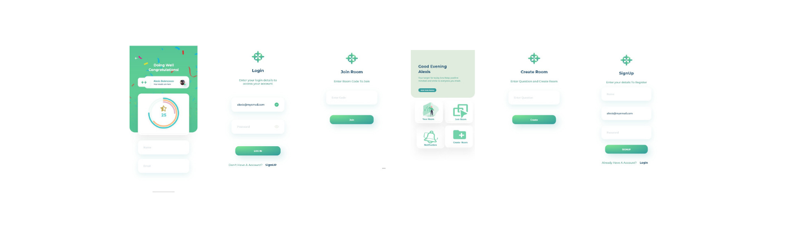

  

<h1 align="center">
  Preceptor
</h1>

## What is Preceptor?

- An interaction or a discussion app between the teacher and the student that helps the teacher understand about the clear-learning of the students.

# ScreenShots💕

  

# How to Use Preceptor?

- Step-1: Download the App ✔
- Step-2: If you are an existing user then login with your details else signup.
- Step-3:If you are a teacher then create room and if a student then join the room.
- Step-4: Now the teachers will post the query and students will answer accordingly.
- Step-5:Students will be rated by their answers which will be reflected on their profile.

## Developers

- 🧒🏻 Rhythm Verma :https://github.com/ritmojs
- 👩🏻 Gargi : https://github.com/gargijs

# ThankYou ❤

<h1 align="center">
   © Preceptor 2020
</h1>
